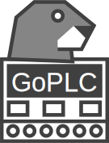

_My first attempt at the logo, looks more like a seal. Will update when I have time._

---

<!--

-->

A soft PLC written in Go that replaces proprietary industrial programming languages with modern development tools.

## Motivation

Industrial automation is stuck in the past. Proprietary IDEs, vendor lock-in, no real version control, and languages that don't transfer to any other domain. If you're going to learn something new anyway, why not use a real programming language with modern tooling? GoPLC lets you write control logic in native Go using VS Code, Git, and CI/CD pipelines instead of being locked into Ladder Logic or Structured Text. It's time to bring software development practices from the last two decades into industrial automation.

## Quick Start

Coming soon. Installation and usage instructions will be added as the project develops.

## Usage

### What is a Soft PLC?

A traditional PLC is a specialized industrial computer that runs control logic for manufacturing equipment. A soft PLC does the same thing but runs on standard hardware—the control software without the proprietary box.

### Architecture Overview

GoPLC communicates with industrial devices via standard protocols and exposes data through multiple interfaces:

**Input/Output:**
- Modbus TCP/RTU for sensors, actuators, and I/O modules
- Automatic reconnection with exponential backoff

**SCADA Integration:**
- OPC UA server for traditional industrial SCADA systems
- Sparkplug B over MQTT for modern IIoT architectures
- GraphQL API for custom integrations

**Monitoring:**
- Built-in WebUI for real-time monitoring and control
- System health, connection status, variable values, task execution

Variables are defined once in YAML and automatically exposed to all protocols. The runtime handles scheduling, scaling, and protocol translation.

## Contributing

Contributions are welcome. If you find a bug or have a feature request, please open an issue. If you want to submit code, please open a pull request with a clear description of your changes.

## Development Methodology

This project uses a hybrid AI-assisted workflow:

| Phase | Who |
|-------|-----|
| Planning & Documentation | AI-assisted (BMAD framework) |
| PRD, UX Design, Architecture | AI-assisted |
| Epics & Stories | AI-assisted (written for human developers) |
| **Development** | **Human (me)** |
| Code Review & QA | AI-assisted |

The goal: leverage AI where it excels (structured documentation, planning, review) while keeping implementation skills sharp through hands-on development.

## License

O'Saasy License Agreement - MIT do-whatever-you-want license, but with the commercial rights for SaaS reserved for the copyright holder.
