# UX Design Specification go-plc

**Author:** Andy
**Date:** 2025-12-14

---

## Executive Summary

### Project Vision

go-plc is a fast, simple soft PLC built in Go that enables automation engineers to develop and test PLC programs using modern software development tools. The WebUI serves as the monitoring and control interface - providing real-time visibility into system health, variables, and task execution for operators, engineers, and integrators.

### Target Users

**Primary WebUI Users:**

1. **Operations/Maintenance (Jake)** - Night shift technicians who need to troubleshoot issues without calling the controls engineer. Requires clear status indicators, actionable diagnostic information, and mobile-friendly access on tablet.

2. **Automation Engineers (Marcus)** - Uses WebUI to verify system operation, check task status, and validate integrations during development and commissioning.

3. **IoT/Edge Developers (Sarah)** - Uses WebUI to monitor data flow and verify protocol connections during integration work.

4. **System Integrators (David)** - Uses WebUI during commissioning to verify connections and system health across multiple sites.

**Usage Context:** Primarily desktop for development, testing, and deployment validation. Mobile/tablet access for field troubleshooting scenarios.

### Key Design Challenges

1. **Diagnostic Clarity** - Source status must show actionable information: connection state, last successful poll, error details. Help operators determine if issues are network-related, device-related, or configuration-related.

2. **Information Density** - Support 100+ variables with smart organization: filterable/scrollable table, YAML-defined tag-based grouping, source-based grouping, and search.

3. **Future Growth** - Architecture must accommodate tab expansion: Overview, Config, Tasks (coding), Logs.

### Design Opportunities

1. **Real-time Confidence** - GraphQL subscriptions enable live updates with visual feedback that builds operator trust.

2. **Source Health Dashboard** - At-a-glance view of all connections with drill-down diagnostics for troubleshooting.

3. **Tag-Based Organization** - YAML tags become powerful UI filtering and grouping mechanisms.

## Core User Experience

### Defining Experience

The go-plc WebUI is a monitoring and control dashboard where the primary user action is **status verification** - quickly answering "is everything running correctly?" The critical path is **problem diagnosis** - when something is wrong, the UI must immediately surface what's broken with actionable information.

### Platform Strategy

| Aspect | Decision |
|--------|----------|
| Primary Platform | Desktop web browser (Chrome, Firefox, Edge) |
| Secondary Platform | Tablet browser for field troubleshooting |
| Input Method | Mouse/keyboard primary, touch secondary |
| Offline Support | Not required - WebUI connects to running PLC |
| Tech Stack | React + urql with GraphQL subscriptions |

### Effortless Interactions

- **System health at a glance** - No clicks required to see if PLC is running and sources are connected
- **Find any variable** - Search/filter to locate specific values instantly
- **Understand failures** - Error states are self-explanatory with human-readable messages

### Critical Success Moments

1. **The 2 AM Glance** - Jake opens the WebUI on his tablet and immediately knows what's wrong without hunting through menus
2. **Commissioning Confidence** - David verifies all Modbus sources are connected and polling correctly in seconds
3. **Development Validation** - Marcus confirms his task is running and variables are updating as expected

### Experience Principles

1. **Status at a Glance** - System health is immediately visible. No clicks required to answer "is everything running?"

2. **Problems Surface Themselves** - When something is wrong, the UI tells you what and where. Errors are prominent, actionable, and human-readable.

3. **Clean and Minimal** - Every element earns its place. No clutter, no decorative complexity. KISS principles throughout.

4. **Real-time Confidence** - Live data updates build trust. Users always know they're seeing current state, not stale data.

5. **Progressive Disclosure** - Overview first, details on demand. Don't overwhelm with information, but make drill-down easy.

## Desired Emotional Response

### Primary Emotional Goals

**Professional Calm** - The WebUI should feel like a well-designed control room interface. Quiet confidence, not consumer app excitement. Users should feel:

- **Confident** - "I know exactly what's happening with my system"
- **In Control** - "I can see and manage everything from here"
- **Calm** - Even when there's a problem, the UI helps rather than adds stress

### Emotional Journey

| Stage | Desired Emotion | Design Implication |
|-------|-----------------|-------------------|
| First open | Clarity | Simple layout, immediate orientation |
| Normal operation | Quiet trust | Low visual noise, subtle "live" indicators |
| Something breaks | Calm competence | Problem surfaces clearly, actionable info visible |
| After fixing | Accomplishment | Clear confirmation, return to calm state |

### ISA-101 Alignment

Following ISA-101 High Performance HMI principles:

1. **Abnormal situations stand out** - Normal operation is visually quiet; only errors and warnings demand attention
2. **Hierarchy of states** - Visual weight matches severity (error > warning > info)
3. **Reduced operator fatigue** - No unnecessary visual noise, animations, or attention-grabbing elements during normal operation
4. **Situation awareness** - At-a-glance understanding of system state without cognitive load

### Emotions to Avoid

- **Confusion** - "Where do I even look?"
- **Anxiety** - "Is this data stale? Is something I'm not seeing broken?"
- **Fatigue** - "Too many flashing lights and colors competing for attention"
- **Frustration** - "Why can't I find what I need?"

### Emotional Design Principles

1. **Calm by Default** - Normal operation uses muted, low-contrast visuals. Nothing "pops" when everything is fine.

2. **Alert When Needed** - Errors and warnings use distinct visual treatment that breaks through the calm baseline.

3. **Trust Through Liveness** - Subtle indicators confirm data is current without being distracting (e.g., quiet timestamp, minimal pulse).

4. **Professional, Not Playful** - Industrial reliability aesthetic. No gamification, no unnecessary delight moments. Competence is the feeling.

## UX Pattern Analysis & Inspiration

### Inspiring Products Analysis

**Tentacle PLC WebUI**
- Light gray background with white content cards
- Two-column layout: Tasks panel and Variables panel
- Source bindings shown as subtle colored tags/pills
- Task cards display: name, description, scan rate badge, execution timing
- Logo positioned in top-left corner
- **Adopt:** Card-based content organization, source tagging pattern, logo placement

**Level23 Solutions SCADA**
- Clean theme with navy/teal accent colors
- Status cards with clear hierarchy: primary metric → status → supporting data
- Semantic color for status text (green=good, orange=warning, red=error)
- ISA-101 aligned visual hierarchy
- **Adopt:** Semantic status colors, metric card hierarchy, ISA-101 principles

**Tailscale**
- Monochrome, minimal, professional aesthetic
- Typography-driven visual hierarchy
- Confidence through restraint
- **Adopt:** Minimal decorative elements, whitespace usage, professional tone

### Transferable UX Patterns

**Layout Patterns:**
- Card-based content sections for Tasks and Variables
- Persistent alerts banner (collapsible) - same position across all pages
- Logo/branding top-left corner

**Source Tag Pattern:**
- Source name as colored tag/pill indicating connection status
- Connected source: muted green tag
- Disconnected source: red tag (draws attention per ISA-101)
- Additional YAML-defined tags appear after source tag in neutral color

**Alerts Banner Pattern:**
- Collapsible banner showing error/warning count
- New alert triggers 3-second animation on badge to draw attention
- Non-intrusive - doesn't consume main content space
- Expandable to show alert details

**Task Display Pattern:**
- Task name and description
- Scan rate as badge
- Execution time metrics

### Anti-Patterns to Avoid

- **Christmas tree SCADA** - Everything blinking, colored, competing for attention
- **Card shadows and decorative depth** - Adds visual noise without function
- **Icon-only status** - Requires memorization; pair with text
- **Nested navigation** - Multiple clicks to reach common information
- **Alert cards in main content** - Takes space from primary information

### Design Inspiration Strategy

**Adopt Directly:**
- Card-based content organization from Tentacle
- Source tagging as colored pills with connection status
- Minimal decorative elements from Tailscale
- Logo top-left placement

**Adapt for GoPLC:**
- Alerts as collapsible banner instead of card panel
- Apply Graphite/Teal/Yale Blue palette
- Source tags show connection state via color

**Branding:**
- Name: **GoPLC**
- Custom gopher-inspired mascot (non-infringing on Go trademark)
- Simple design that works at small sizes and in monochrome

**Typography:**
- **Roboto** - clean, readable, open source, excellent for data-dense interfaces

## Design System Foundation

### Design System Choice

**Tailwind CSS + shadcn/ui** with custom theming for GoPLC brand identity.

### Tech Stack

| Layer | Choice | Rationale |
|-------|--------|-----------|
| Framework | React | Component-based, ecosystem, familiarity |
| Build Tool | Vite | Fast HMR, optimized builds, modern DX |
| GraphQL Client | urql | Lightweight, first-class subscriptions, ~5kb |
| Styling | Tailwind CSS | Utility-first, full control, purged CSS |
| Components | shadcn/ui | Copy-paste ownership, accessible, customizable |
| Font | Roboto | Clean, readable, open source |

### Rationale for Selection

1. **Custom aesthetic control** - GoPLC's ISA-101 aligned design and unique palette require full styling control. Tailwind provides this without fighting framework opinions.

2. **Real-time first** - urql's subscription support is critical for live variable updates and connection status.

3. **Bundle size** - All lightweight choices support the single-binary deployment model (Go embed).

4. **Solo developer velocity** - Tailwind utilities + shadcn/ui components enable rapid development without context-switching to CSS files.

5. **Dark theme native** - Both Tailwind and shadcn/ui have excellent dark mode support out of the box.

### Implementation Approach

1. Initialize Vite + React + TypeScript project
2. Install and configure Tailwind CSS with custom color palette
3. Add shadcn/ui and customize theme tokens
4. Configure urql with subscription support (WebSocket)
5. Set up Roboto font via Google Fonts or self-hosted

### Customization Strategy

**Color Tokens (Tailwind config):**

```javascript
colors: {
  graphite: '#353535',
  'stormy-teal': '#3C6E71',
  white: '#FFFFFF',
  'alabaster-grey': '#D9D9D9',
  'yale-blue': '#284B63',
  // Status colors
  'status-ok': '#4A7C59',      // Muted green
  'status-error': '#C45C5C',   // Attention red
  'status-warning': '#D4A84B', // Amber
}
```

**shadcn/ui components to install:**
- Table (variables list)
- Badge (source tags, scan rates)
- Card (content panels)
- Button (enable/disable controls)
- Collapsible (alerts banner)
- Input (search/filter)

## Defining User Experience

### Defining Experience Statement

**"Glance and Know"** - Open the UI and immediately understand system health without clicking anything.

The GoPLC WebUI's core promise is instant situational awareness. Users open the interface and within one glance know: Is the PLC running? Are my sources connected? Are there any problems I need to address?

Secondary defining experience: **"See the problem, understand the fix"** - When something breaks, the UI tells you what and why in plain language, not cryptic error codes.

### User Mental Model

**What users bring to GoPLC:**
- Expectation of "green = good, red = bad" (but we apply ISA-101: quiet normal, loud abnormal)
- Looking for status overview first, then drilling into specifics
- Familiar with source/device connection concepts from industrial systems
- Used to variable/tag tables from SCADA and PLC programming environments

**Where existing solutions frustrate:**
- Can't tell if data is stale or live
- Error messages are codes, not explanations
- Too many clicks to find basic status
- Information buried in nested menus
- Busy displays with competing visual elements

### Success Criteria

**Users say "this just works" when:**
1. Opening the UI immediately shows PLC running/stopped state
2. All source connection states visible without scrolling
3. Disconnected sources visually stand out (ISA-101 principle)
4. Variable values update in real-time visibly
5. Error messages explain what's wrong in human language

**Performance targets:**
- Page load to status visible: <1 second (ideal), <2 seconds (acceptable)
- Variable value update latency: <500ms (perceivably instant)
- Filter/search response: immediate

### Experience Mechanics

**1. Initiation - Opening GoPLC:**
- User navigates to WebUI URL
- Page loads with status already visible (no loading spinners blocking content)
- GraphQL subscription connects automatically

**2. Primary Interaction - Status Verification:**
- PLC status (running/stopped) immediately visible in header area
- Source connection cards show all sources with connection state
- Alerts banner shows error/warning count (expandable for details)
- No clicks required for basic "is everything OK?" answer

**3. Secondary Interaction - Investigation:**
- Click source card to see details (last poll time, error message)
- Filter/search variables table to find specific values
- Expand alerts banner to see error details and timestamps

**4. Feedback - Confidence Building:**
- Real-time value updates confirm data is live
- Subtle "live" indicator or timestamp shows connection is active
- Source tags on variables show which source provides each value
- Disconnected sources turn red immediately when connection fails

**5. Diagnostic Support - System Health:**
- Computer stats card shows CPU, memory, uptime for performance troubleshooting
- Positioned in secondary location (doesn't compete with primary status)
- Useful for diagnosing long-running process issues or performance problems

## Visual Design Foundation

### Color System

**Brand Palette:**

| Token | Hex | Role |
|-------|-----|------|
| Graphite | `#353535` | Dark theme background |
| Stormy Teal | `#3C6E71` | Primary accent, interactive elements |
| White | `#FFFFFF` | Light theme background, dark theme text |
| Alabaster Grey | `#D9D9D9` | Borders, disabled states, secondary text |
| Yale Blue | `#284B63` | Cards/panels (dark theme), accents (light theme) |

**Status Colors (ISA-101 aligned):**

| State | Hex | Usage |
|-------|-----|-------|
| OK/Connected | `#4A7C59` | Muted green - connected sources, success states |
| Error/Disconnected | `#C45C5C` | Attention red - errors, disconnected sources |
| Warning | `#D4A84B` | Amber - warnings, attention needed |

**Theme Tokens:**

| Token | Dark Theme | Light Theme |
|-------|------------|-------------|
| `--background` | Graphite `#353535` | White `#FFFFFF` |
| `--foreground` | White `#FFFFFF` | Graphite `#353535` |
| `--card` | Yale Blue `#284B63` | White `#FFFFFF` |
| `--card-border` | Alabaster Grey `#D9D9D9` (10% opacity) | Alabaster Grey `#D9D9D9` |
| `--muted` | Alabaster Grey `#D9D9D9` | Alabaster Grey `#D9D9D9` |
| `--accent` | Stormy Teal `#3C6E71` | Stormy Teal `#3C6E71` |

### Typography System

**Font Family:** Roboto (primary), Roboto Mono (values/code)

| Level | Size | Weight | Line Height | Usage |
|-------|------|--------|-------------|-------|
| H1 | 24px | 500 | 1.2 | Page titles |
| H2 | 20px | 500 | 1.3 | Section headers |
| H3 | 16px | 500 | 1.4 | Card headers |
| Body | 14px | 400 | 1.5 | Primary content |
| Small | 12px | 400 | 1.4 | Labels, timestamps |
| Mono | 14px | 400 | 1.5 | Variable values, code |

### Spacing & Layout Foundation

**Base Unit:** 4px

**Spacing Scale:**
- `xs`: 4px (tight grouping)
- `sm`: 8px (related elements)
- `md`: 16px (card padding, standard gaps)
- `lg`: 24px (section separation)
- `xl`: 32px (major sections)

**Layout Principles:**
1. **Efficient density** - Data-dense but clearly grouped
2. **Card styling** - Subtle border (1px), no shadows
3. **Consistent gutters** - 16px between cards
4. **Touch-friendly** - Minimum 44px touch targets for tablet use
5. **Responsive** - Desktop-first, graceful tablet adaptation

**Grid System:**
- Desktop: Flexible multi-column layout
- Tablet: Single or two-column depending on content
- Maximum content width: 1440px

### Accessibility Considerations

**Contrast Requirements:**
- Text on background: Minimum 4.5:1 ratio (WCAG AA)
- Large text (18px+): Minimum 3:1 ratio
- Interactive elements: Clear focus states

**Color Independence:**
- Status indicated by color AND text/icon
- Never rely on color alone for critical information

**Theme Support:**
- Both dark and light themes available
- Respects system preference by default
- Manual toggle available in UI

## Design Direction Decision

### Design Directions Explored

Three design directions were evaluated for the GoPLC WebUI:

1. **Top Navigation (Horizontal)** - Traditional top nav with tabs, alerts in sidebar, content below
2. **Dashboard Cards** - Large status cards as primary view, drill-down navigation
3. **Sidebar Navigation** - Vertical nav sidebar, full-width alerts banner, content grid (SELECTED)

### Chosen Direction

**Direction 3: Sidebar Navigation with Full-Width Info Bar** was selected as it best supports the "Glance and Know" experience while accommodating future navigation growth.

**Key Layout Structure:**

```
┌───────────────────────────────────────────────────────────────┐
│ [Alerts ▼] 1 Error 2 Warnings              Live • PLC Running │  ← Info Bar (full width)
├────┬──────────────────────────────────────────────────────────┤
│ Go │  Overview                                                │
│ ── │                                                          │
│ ▣  │  ┌────────────────────────────────┐ ┌─────────────────┐  │
│ ⚙  │  │ Sources (2/3 width)            │ │ System (1/3)    │  │  ← Row 1: ~1/3 height
│ <> │  │ (table format)                 │ │ CPU/RAM/Uptime  │  │
│ 📄 │  └────────────────────────────────┘ └─────────────────┘  │
│    │                                                          │
│ ── │  ┌────────────────────────────────┐ ┌─────────────────┐  │
│ ☀  │  │ Tasks (2/3 width)              │ │ Variables (1/3) │  │  ← Row 2: fills remaining
│    │  │ (table format)                 │ │ (searchable)    │  │
│    │  │                                │ │                 │  │
└────┴──┴────────────────────────────────┴─┴─────────────────┴──┘
  ↑ Sidebar collapsed by default (56px), expands on click
```

### Design Rationale

1. **Full-Width Info Bar** - Eyes naturally scan top-left first; alerts and PLC status are immediately visible without any interaction

2. **Graphite-Dominant Color Scheme** - Reduced Yale Blue usage; cards use `--graphite-light (#404040)` instead of Yale Blue for a calmer, more professional appearance aligned with ISA-101 principles

3. **Sidebar Navigation** - Provides clear navigation structure that scales as new tabs are added (Config, Tasks, Logs); doesn't compete with content area

4. **Table-Based Panels** - Sources, Tasks, and Variables all use consistent table format within card panels for visual consistency and efficient data density

5. **System Stats Placement** - Positioned adjacent to Sources table (row 1, right side) as secondary diagnostic information

6. **Collapsible Alerts** - Alerts panel expands below info bar on demand; doesn't consume space during normal operation

### Implementation Approach

**Layout Components:**
- `InfoBar` - Full-width top bar with alerts toggle, badges, live indicator, PLC status
- `AlertsPanel` - Collapsible panel below info bar showing alert details
- `Sidebar` - Collapsible navigation (56px collapsed, 200px expanded), defaults to collapsed showing only logo icon and nav icons
- `ContentArea` - Scrollable content grid with panel cards
- `Panel` - Reusable card component with header, optional search, table content

**Grid Structure:**
- Row 1 (~1/3 height): Sources table (2fr) + System Stats (1fr)
- Row 2 (fills remaining): Tasks table (2fr) + Variables table (1fr)
- Responsive: Collapses to single column below 1024px

**Sidebar Behavior:**
- Collapsed by default (icon-only view)
- Click logo to expand/collapse
- Expanded shows full nav labels
- Tooltips on icons when collapsed

**Color Application (Dark Theme):**
- Background: Graphite `#353535`
- Cards: Graphite Light `#404040`
- Borders: Alabaster Grey at 15% opacity
- Accent: Stormy Teal `#3C6E71` for active states
- Status colors per ISA-101 alignment

**Interactive HTML Mockup:** See [ux-design-directions.html](ux-design-directions.html) for full visual reference with theme toggle functionality.

## User Journey Flows

### Journey 1: Jake's 2 AM Troubleshooting

**User:** Operations/Maintenance Technician (night shift)
**Goal:** Diagnose why SCADA data isn't updating without calling the controls engineer
**Entry Point:** Open WebUI on tablet after noticing SCADA alarm


**Key Interactions:**
1. **Glance at Info Bar** - Immediately see PLC status and alert count
2. **Expand Alerts** - One click to see error details
3. **Check Sources Table** - See which connection failed and when
4. **Verify Fix** - Watch real-time status change from red to green

**Success Criteria:**
- Jake diagnoses the problem in <30 seconds
- No hunting through menus or clicking multiple tabs
- Clear, human-readable error message (not error codes)
- Real-time feedback confirms the fix worked

### Journey 2: Marcus's Development Validation

**User:** Automation Engineer
**Goal:** Verify system operation after deploying updated task logic
**Entry Point:** Open WebUI after deploying new binary

```mermaid
flowchart TD
    A[Deploy updated binary] --> B[Open GoPLC WebUI]
    B --> C{Info Bar: PLC Running?}
    C -->|Yes| D[Check Tasks table]
    C -->|No| E[Check logs, restart service]
    D --> F{Task showing in list?}
    F -->|Yes| G[Verify scan rate correct]
    F -->|No| H[Check task file discovery]
    G --> I[Check execution time column]
    I --> J{Execution time reasonable?}
    J -->|Yes| K[Check Variables table]
    J -->|No| L[Optimize task logic]
    K --> M[Search for specific variable]
    M --> N{Value updating?}
    N -->|Yes| O[Watch for expected behavior]
    N -->|No| P[Check source connection]
    O --> Q{Behavior correct?}
    Q -->|Yes| R[Validation complete ✓]
    Q -->|No| S[Debug task logic]
    P --> T[Check Sources table status]
```



**Key Interactions:**
1. **Verify PLC Running** - Info Bar confirms runtime status
2. **Check Tasks** - Scan rate and execution time visible
3. **Search Variables** - Quick filter to find specific values
4. **Monitor Values** - Real-time updates confirm data flow

**Success Criteria:**
- All validation checks visible from Overview page
- Task status shows scan rate and actual execution time
- Variable search finds values instantly
- Real-time updates confirm live data

### Journey 3: David's Commissioning Verification

**User:** System Integrator
**Goal:** Verify all connections are working during site commissioning
**Entry Point:** Open WebUI after initial deployment at new site

```mermaid
flowchart TD
    A[Complete hardware installation] --> B[Start GoPLC service]
    B --> C[Open WebUI in browser]
    C --> D{Info Bar: PLC Running?}
    D -->|Yes| E[Check Sources table]
    D -->|No| F[Check configuration YAML]
    E --> G{All sources connected?}
    G -->|Yes| H[Verify poll times reasonable]
    G -->|No| I[Note disconnected sources]
    I --> J[Check IP addresses in config]
    J --> K[Verify network connectivity]
    K --> L[Fix network/config issue]
    L --> M[Watch source turn green]
    H --> N[Check System stats]
    N --> O{CPU/Memory normal?}
    O -->|Yes| P[Check Variables table]
    O -->|No| Q[Investigate resource usage]
    P --> R[Verify expected variables present]
    R --> S[Check source tags on variables]
    S --> T{All variables mapped?}
    T -->|Yes| U[Commissioning complete ✓]
    T -->|No| V[Check variable YAML config]
```



**Key Interactions:**
1. **Sources Table Review** - All connections visible at once
2. **Address Verification** - IP:port visible for each source
3. **Poll Time Check** - Confirm reasonable polling latency
4. **System Health** - CPU/Memory/Uptime for baseline
5. **Variable Mapping** - Source tags show data origin

**Success Criteria:**
- All Modbus sources show green status
- Poll times are consistent and reasonable (<500ms)
- System resources show normal utilization
- Variables display with correct source tags

### Journey Patterns

**Navigation Patterns:**
- **No-Click Overview** - Critical status visible immediately on page load
- **Expand-on-Demand** - Alerts panel expands only when clicked
- **Search-First Variables** - Filter/search prioritized over scrolling

**Feedback Patterns:**
- **Live Indicator** - Subtle pulse confirms real-time connection
- **Color + Text Status** - Never rely on color alone (accessibility)
- **Timestamp Context** - "45ms ago" not just "connected"

**Error Patterns:**
- **Human-Readable Messages** - "Connection timeout after 3 retries" not "ERR_0x45"
- **Source Attribution** - Error messages include source/variable name
- **Actionable Context** - Show IP address, last successful poll time

### Flow Optimization Principles

1. **Minimize Time to Diagnosis** - Critical information visible without clicks
2. **Progressive Detail** - Overview → Table → Expanded Details hierarchy
3. **Real-Time Confidence** - Visual feedback that data is live, not stale
4. **Clear Error Recovery** - When something breaks, the path to fix is obvious
5. **Mobile-First Troubleshooting** - Touch-friendly for tablet access in the field

## Component Strategy

### Design System Components

**From shadcn/ui (to install and customize):**

| Component | Usage in GoPLC | Customization |
|-----------|----------------|---------------|
| Table | Sources, Tasks, Variables lists | Custom row styling, monospace values |
| Badge | Source tags, scan rate, status | Status color variants |
| Card | Panel containers | Subtle border, no shadow |
| Button | Enable/disable controls | Stormy Teal accent |
| Collapsible | Alerts panel | Custom trigger styling |
| Input | Search/filter field | Dark theme styling |
| Tooltip | Help text, timestamps | Consistent positioning |

**From Tailwind CSS (utility-first):**
- Layout system (flex, grid)
- Spacing scale (4px base)
- Typography (Roboto integration)
- Dark/light theme via CSS variables
- Responsive breakpoints

### Custom Components

#### InfoBar Component

**Purpose:** Global status bar showing alerts and PLC runtime state
**Location:** Top of viewport, full width, always visible

**Anatomy:**
```
┌─────────────────────────────────────────────────────────────────┐
│ [▼ Alerts] [1 Error badge] [2 Warnings badge]  [●] Live  PLC Running [●] │
└─────────────────────────────────────────────────────────────────┘
```

**Props:**
- `alertCounts: { errors: number, warnings: number }`
- `plcStatus: 'running' | 'stopped'`
- `isLive: boolean`
- `onAlertsToggle: () => void`

**States:**
- Default: Graphite background, muted text
- Has Errors: Error badge visible with count
- Has Warnings: Warning badge visible with count
- PLC Stopped: Status dot red, text "PLC Stopped"

#### AlertsPanel Component

**Purpose:** Expandable panel showing alert details
**Location:** Below InfoBar, collapses to zero height

**Anatomy:**
```
┌─────────────────────────────────────────────────────────────────┐
│ [●] modbusFlowMeter - Connection timeout after 3 retries    2m │
│ [▲] pressureTubing - Value approaching high limit (247 psi) 5m │
└─────────────────────────────────────────────────────────────────┘
```

**Props:**
- `alerts: Alert[]` (type, source, message, timestamp)
- `isExpanded: boolean`

**States:**
- Collapsed: height 0, hidden
- Expanded: auto height, visible with animation

#### Panel Component

**Purpose:** Reusable container for content sections (Sources, Tasks, Variables, System)
**Usage:** All content cards in the main grid

**Anatomy:**
```
┌─────────────────────────────────┐
│ Panel Title              [3]   │  ← Header with optional count
├─────────────────────────────────┤
│ [Search input]                 │  ← Optional search (Variables)
├─────────────────────────────────┤
│ Table or content               │  ← Scrollable content area
└─────────────────────────────────┘
```

**Props:**
- `title: string`
- `count?: number`
- `showSearch?: boolean`
- `onSearch?: (query: string) => void`
- `maxHeight?: string`
- `children: ReactNode`

#### SourceTag Component

**Purpose:** Colored pill showing source name with connection status
**Usage:** Variables table, indicating data origin

**Anatomy:**
```
[modbusRemoteIO]  ← Connected (muted green background)
[modbusFlowMeter] ← Disconnected (red background)
```

**Props:**
- `sourceName: string`
- `status: 'connected' | 'disconnected'`

**States:**
- Connected: `bg-status-ok/15 text-status-ok`
- Disconnected: `bg-status-error/15 text-status-error`

#### StatusDot Component

**Purpose:** Small colored indicator for connection/runtime status
**Usage:** Info Bar PLC status, Sources table, Live indicator

**Props:**
- `status: 'ok' | 'error' | 'warning'`
- `pulse?: boolean` (for Live indicator)
- `size?: 'sm' | 'md'`

**States:**
- OK: `bg-status-ok` (#4A7C59)
- Error: `bg-status-error` (#C45C5C)
- Warning: `bg-status-warning` (#D4A84B)
- Pulsing: CSS animation for Live indicator

#### DataTable Component

**Purpose:** Consistent table styling for Sources, Tasks, Variables
**Usage:** All data list views

**Features:**
- Sticky header on scroll
- Row hover state
- Monospace font for values
- Sortable columns (future)
- Custom cell renderers

**Props:**
- `columns: Column[]`
- `data: T[]`
- `rowKey: keyof T`
- `onRowClick?: (row: T) => void`

### Component Implementation Strategy

**Build Order (by dependency):**

1. **Foundation Layer:**
   - CSS variables and theme tokens
   - Tailwind config with custom colors
   - Base typography and spacing

2. **Primitive Components:**
   - StatusDot (used by InfoBar, Sources, Variables)
   - SourceTag (used by Variables)
   - Badge variants (errors, warnings, scan rate)

3. **Composite Components:**
   - Panel (container for all content)
   - DataTable (inside Panels)
   - AlertsPanel (expandable detail)

4. **Layout Components:**
   - InfoBar (top-level status)
   - Sidebar (navigation)
   - ContentGrid (main area layout)

**Component Architecture:**
```
App
├── InfoBar
│   ├── AlertsToggle (Collapsible trigger)
│   ├── Badge (error count)
│   ├── Badge (warning count)
│   ├── LiveIndicator (StatusDot + text)
│   └── PLCStatus (StatusDot + text)
├── AlertsPanel (Collapsible content)
│   └── AlertItem[] (icon + message + time)
├── Sidebar
│   ├── Logo
│   ├── NavMenu
│   │   └── NavItem[]
│   └── ThemeToggle
└── MainContent
    ├── PageHeader
    └── ContentGrid
        ├── Panel (Sources)
        │   └── DataTable
        ├── Panel (System Stats)
        │   └── StatsGrid
        ├── Panel (Tasks)
        │   └── DataTable
        └── Panel (Variables)
            ├── SearchInput
            └── DataTable
```

### Implementation Roadmap

**Phase 1 - Core Layout (MVP Critical):**
- [ ] InfoBar with PLC status and alert badges
- [ ] Sidebar with navigation
- [ ] Panel container component
- [ ] Basic DataTable component
- [ ] StatusDot component

**Phase 2 - Data Display:**
- [ ] Sources table with status
- [ ] Tasks table with execution metrics
- [ ] Variables table with source tags
- [ ] System stats grid
- [ ] SourceTag component

**Phase 3 - Interactivity:**
- [ ] AlertsPanel expansion
- [ ] Variable search/filter
- [ ] Theme toggle (dark/light)
- [ ] Real-time value updates (GraphQL subscriptions)

**Phase 4 - Enhancement:**
- [ ] Enable/disable controls
- [ ] Sortable table columns
- [ ] Variable grouping/filtering by tag
- [ ] Responsive tablet layout

## UX Consistency Patterns

### Status Indication Patterns

**Connection Status (ISA-101 Aligned):**

| State | Visual | Text | Usage |
|-------|--------|------|-------|
| Connected/OK | `●` Muted green (#4A7C59) | "connected" | Sources, PLC running |
| Disconnected/Error | `●` Red (#C45C5C) | "disconnected" / "error" | Failed connections, PLC stopped |
| Warning | `●` Amber (#D4A84B) | "warning" | Value limits, approaching thresholds |
| Unknown/Stale | `●` Grey (#D9D9D9) | "unknown" | Initial state, no data yet |

**Rules:**
- Normal states are visually quiet (muted colors)
- Error states break through the visual hierarchy (brighter, attention-grabbing)
- Always combine color with text (accessibility)
- Status dots are 8px for primary indicators, 6px for secondary

**Real-Time Feedback:**

| Indicator | Behavior | Purpose |
|-----------|----------|---------|
| Live dot | 2s pulse animation | Confirms WebSocket connection active |
| Value update | Brief highlight flash | Shows value just changed |
| Timestamp | "45ms ago" format | Shows data freshness |

### Alert Patterns

**Alert Severity Hierarchy:**

```
Error (Red)     → System-impacting issues (connection failures, PLC stopped)
Warning (Amber) → Attention needed (value limits, approaching thresholds)
Info (Teal)     → Informational notices (configuration loaded, task started)
```

**Alert Message Format:**
```
[Source/Variable Name] - [Human-readable description]
```

**Examples:**
- `modbusFlowMeter - Connection timeout after 3 retries`
- `pressureTubing - Value approaching high limit (247 psi)`
- `pumpControl - Task execution exceeded scan rate`

**Alert Badge Behavior:**
- New alert: Badge count increments, 3-second attention animation
- Alert resolved: Badge count decrements, no animation
- Zero alerts: Badge hidden (no "0 Errors" display)

### Navigation Patterns

**Sidebar Navigation:**

| State | Visual Treatment |
|-------|------------------|
| Default | Muted text, transparent background |
| Hover | Slightly lighter background, white text |
| Active | Stormy Teal background, white text |
| Disabled | 50% opacity (future: Config, Tasks, Logs tabs) |

**Rules:**
- Only one nav item active at a time
- Active state persists until different page selected
- Icons accompany text (not icon-only)
- Touch targets minimum 44px height

### Data Display Patterns

**Table Patterns:**

| Element | Treatment |
|---------|-----------|
| Headers | Uppercase, small (11px), muted color, sticky on scroll |
| Row hover | Subtle background highlight (2% white overlay) |
| Values | Roboto Mono for numerical data |
| Empty state | Centered message: "No [items] to display" |

**Value Formatting:**

| Type | Format | Example |
|------|--------|---------|
| Numeric | Up to 1 decimal, unit suffix | `247.3 psi` |
| Time interval | Human-readable | `45ms ago`, `3d 4h` |
| Boolean | Colored text | `true` (green), `false` (muted) |
| Stale/Error | Dashes with muted color | `-- gpm` |

**Search/Filter Pattern:**
- Search input at top of panel
- Instant filtering as user types (no submit button)
- Clear button appears when input has content
- Placeholder: "Search [item type]..."
- Filter matches variable name AND tags

### Button Patterns

**Button Hierarchy (MVP):**

| Type | Usage | Visual |
|------|-------|--------|
| Primary | Main actions (Enable PLC) | Stormy Teal fill, white text |
| Secondary | Supporting actions (Expand alerts) | Transparent, border, white text |
| Danger | Destructive actions (Disable PLC) | Red fill or red text |
| Ghost | Subtle actions (Theme toggle) | No border, muted text, hover highlight |

**Button States:**
- Default: Standard appearance
- Hover: Slight brightness increase
- Active/Pressed: Slight brightness decrease
- Disabled: 50% opacity, no pointer events
- Loading: Spinner replaces text (future)

### Loading & Empty States

**Loading States:**
- Initial page load: Skeleton placeholders for panels
- Data refresh: No visual disruption (silent background update)
- Connection establishing: "Connecting..." text in info bar

**Empty States:**

| Context | Message |
|---------|---------|
| No sources configured | "No sources configured. Add sources in YAML configuration." |
| No tasks discovered | "No tasks found. Add Go task files to /tasks folder." |
| No variables defined | "No variables defined. Configure variables in YAML." |
| Search no results | "No variables match '[query]'" |

### Interaction Feedback Patterns

**Immediate Feedback:**
- Button click: Visual press state
- Toggle action: Immediate state change
- Search input: Instant filtering

**Confirmation Feedback:**
- Action success: Green toast notification (future)
- Action failure: Red toast with error message (future)
- State change: Visual update in relevant panel

### Accessibility Patterns

**Keyboard Navigation:**
- Tab order: Info Bar → Sidebar → Main Content
- Enter/Space: Activate buttons and toggles
- Escape: Close expanded panels
- Arrow keys: Navigate within tables (future)

**Screen Reader Support:**
- ARIA labels on all interactive elements
- Status announcements for alert changes
- Table headers properly associated with cells

**Color Independence:**
- Status always indicated by color AND text
- Error states have distinctive icons in addition to red color
- Sufficient contrast ratios (4.5:1 minimum)
